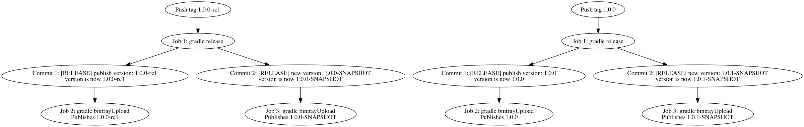
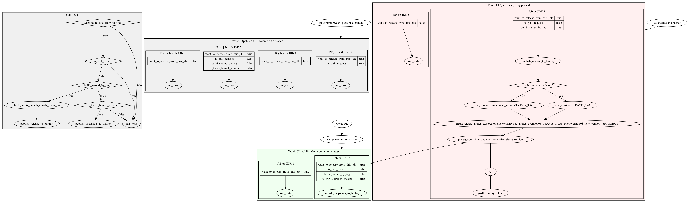

# Zipkin release process

The Zipkin release process is controlled by [publish.sh](publish.sh).
Releases are initiated by pushing a tag `major.minor.revision` or `major.minor.revision-qualifier`,
where `qualifier` is usually something like `rc3`.

There is currently no automated testing during the release process. As the person pushing a release tag, you're
expected to manually check that the test [run on Travis](https://travis-ci.org/openzipkin/zipkin) is green for
the commit you're tagging. (Building tooling for this would be awesome.)

A high-level overview of how the release happens for RC and final releases:

A detailed view at the process:

